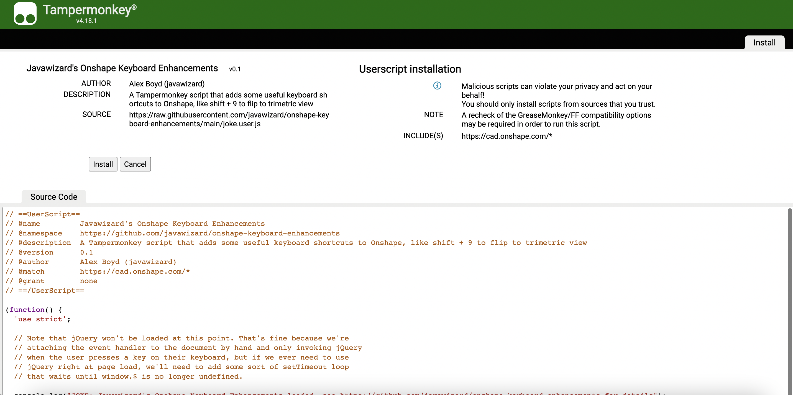

# Javawizard's Onshape Keyboard Enhancements

Javawizard's Onshape Keyboard Enhancements is a Tampermonkey script (read: simplified browser extension) that adds some additional keyboard shortcuts to Onshape.

JOKE adds the following keyboard shortcuts:

- <kbd>shift</kbd> + <kbd>8</kbd>: Switch to **Dimetric** view (analogous to Onshape's native <kbd>shift</kbd> + <kbd>7</kbd> for Isometric view)
- <kbd>shift</kbd> + <kbd>9</kbd>: Switch to **Trimetric** view (ditto)
- <kbd>⌘</kbd> + <kbd>enter</kbd> (mac) or <kbd>ctrl</kbd> + <kbd>enter</kbd> (windows): **Commit the current feature.** This is the same as just pressing <kbd>enter</kbd> except that it also works when sketching (where the Enter key is normally intercepted to commit sketch features like dimensions and seemingly can't be used to commit the sketch itself).

With more to come. (Open an issue if there are any others you'd like to see!)

## Installation

First, install the [Tampermonkey browser add-on for Chrome](https://chrome.google.com/webstore/detail/tampermonkey/dhdgffkkebhmkfjojejmpbldmpobfkfo) (also available for [Edge](https://microsoftedge.microsoft.com/addons/detail/iikmkjmpaadaobahmlepeloendndfphd), [Safari](https://apps.apple.com/us/app/tampermonkey/id1482490089), [Firefox](https://addons.mozilla.org/en-US/firefox/addon/tampermonkey/), and [Opera](https://addons.opera.com/en/extensions/details/tampermonkey-beta/)). This lets you install "userscripts": small, self contained extensions like this one.

Then open the [JOKE userscript file](https://raw.githubusercontent.com/javawizard/onshape-keyboard-enhancements/main/joke.user.js). If you've installed Tampermonkey correctly, it should prompt you to install it as a userscript:

Click the "Install" button. (It may take you to a blank page; don't worry, the install still completed successfully.)

Then head on over to [cad.onshape.com](https://cad.onshape.com) as you normally would (and/or refresh any existing Onshape tabs you already have open). Open a document, then try pressing <kbd>shift</kbd> + <kbd>8</kbd> and then <kbd>shift</kbd> + <kbd>9</kbd> to confirm everything's working as it should be - and you're off to the races!

## Bugs

Feel free to [open an issue](https://github.com/javawizard/onshape-keyboard-enhancements/issues) if you discover any bugs or if you have any enhancement requests.

